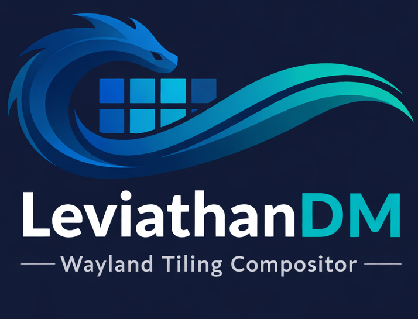

# LeviathanDM - Wayland Compositor

<p align="center">
  
</p>

<p align="center">
  <a href="https://github.com/LeviathanSystems/LeviathanDM/actions/workflows/ci.yml">
    
  </a>
  <a href="https://github.com/LeviathanSystems/LeviathanDM/actions/workflows/docs.yml">
    
  </a>
  <a href="https://github.com/LeviathanSystems/LeviathanDM/releases">
    
  </a>
</p>

A lightweight, customizable tiling Wayland compositor built with wlroots and C++.

**📖 [Full Documentation](https://leviathansystems.github.io/LeviathanDM/)**

## Features

- **Multiple Tiling Layouts** - Master-stack, monocle, grid
- **XWayland Support** - Run X11 applications seamlessly alongside Wayland clients
- **Workspaces** - 9 dynamic workspaces with quick switching
- **Built-in Notification Daemon** - No external daemon needed
- **Tabbed Windows** - Organize windows with tabs (in development)
- **Application Launcher** - Enhanced menubar with desktop app integration
- **Vim-like Keybindings** - Familiar hjkl navigation
- **Layer-Shell Support** - For panels, notifications, and overlays
- **Built-in Help** - Press `Super + F1` for keybinding overlay
- **Customizable** - Colors, gaps, borders, and behavior

## Quick Start

### Dependencies

**Ubuntu/Debian:**
```bash
sudo apt install build-essential cmake meson ninja-build \
  wayland-protocols libwayland-dev libxkbcommon-dev libpixman-1-dev \
  libyaml-cpp-dev libcairo2-dev libgdk-pixbuf-2.0-dev libgtk-3-dev \
  libxcb-dri3-dev libxcb-present-dev libxcb-sync-dev \
  libxcb-composite0-dev libxcb-render-util0-dev libxcb-xinput-dev
```

**Arch Linux:**
```bash
sudo pacman -S base-devel cmake meson ninja wayland wayland-protocols \
  xkbcommon pixman gtk4 gtk-layer-shell
```

### Build & Run

```bash
./build.sh
./build/leviathan
```

Run from a TTY (Ctrl+Alt+F2) or nested in another Wayland session with `cage ./build/leviathan`.

## Essential Keybindings

All keybindings use `Super` (Windows key):

- `Super + Return` - Launch terminal
- `Super + p` - Application launcher
- `Super + F1` - Show all keybindings
- `Super + j/k` - Focus next/previous window
- `Super + 1-9` - Switch workspace
- `Super + Shift + c` - Close window
- `Super + t/m/g` - Switch layout (tile/monocle/grid)

**📖 [Complete keybinding list](https://leviathansystems.github.io/LeviathanDM/docs/getting-started/keybindings/)**

## Configuration

Create `~/.config/leviathan/leviathanrc`:

```bash
border_width 2
gap_size 10
border_focused #5e81ac
border_unfocused #3b4252
focus_follows_mouse true
```

**📖 [Configuration guide](https://leviathansystems.github.io/LeviathanDM/docs/getting-started/configuration/)**

## Documentation

Visit **[leviathansystems.github.io/LeviathanDM](https://leviathansystems.github.io/LeviathanDM/)** for:

- Installation guides
- Feature documentation
- Customization options
- Development guides
- Plugin development
- Architecture details

## Contributing

Contributions are welcome! See the **[Contributing Guide](https://leviathansystems.github.io/LeviathanDM/docs/development/contributing/)** for details.

## Downloads

Pre-built binaries are available on the **[Releases](https://github.com/LeviathanSystems/LeviathanDM/releases)** page.

## License

MIT License - Feel free to modify and distribute!

## Contributing

Built out of frustration with existing window managers/compositors. Feel free to fork and customize!
